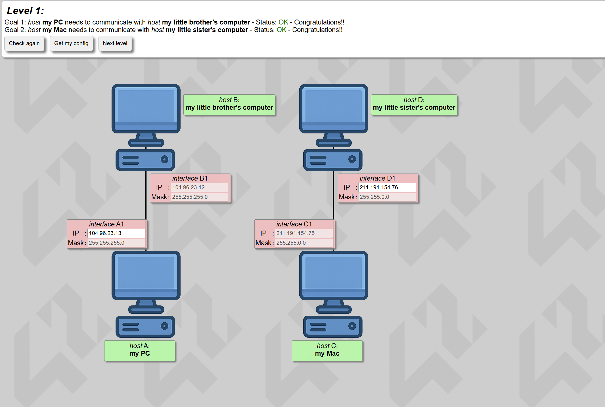
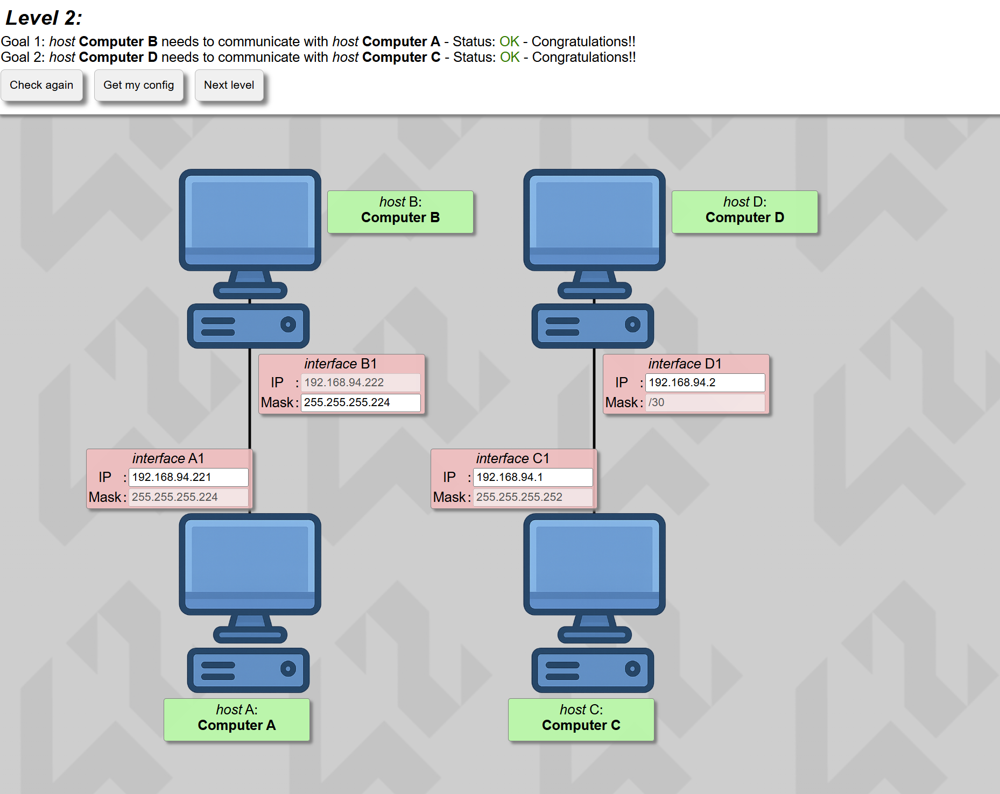
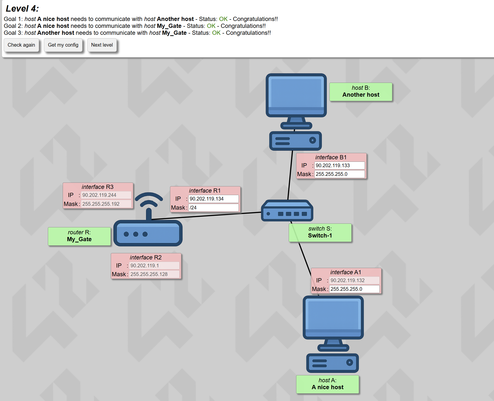
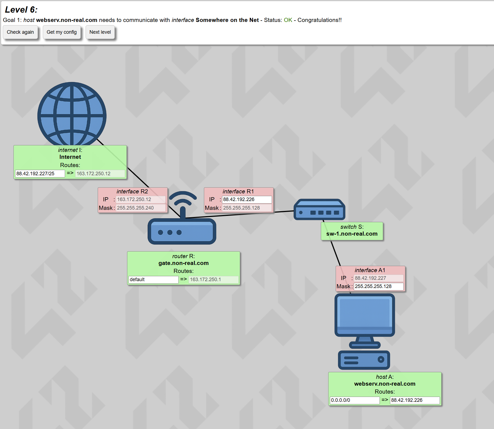
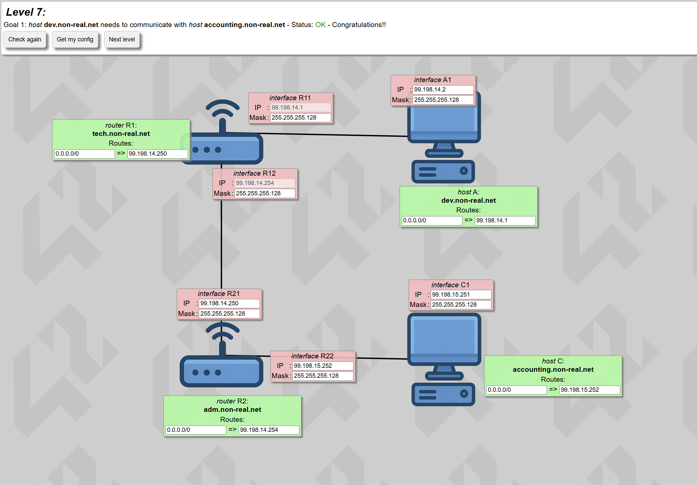
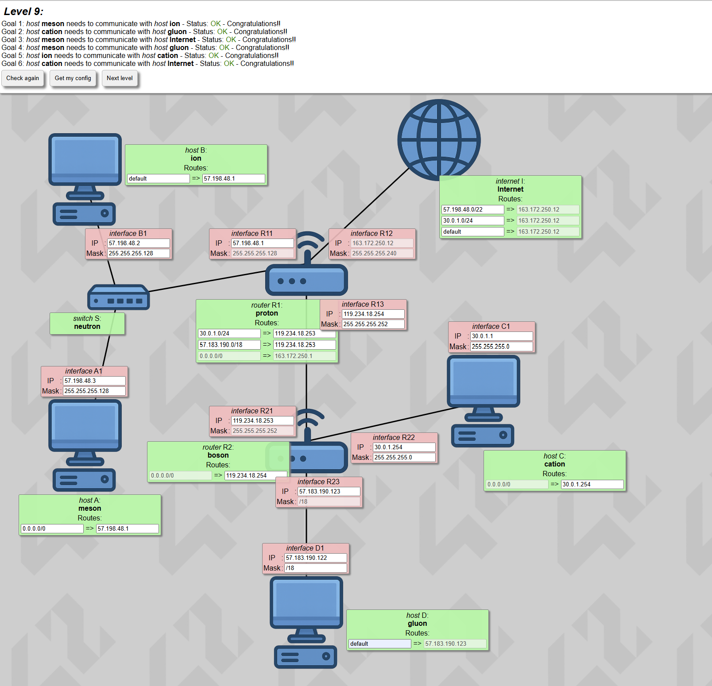
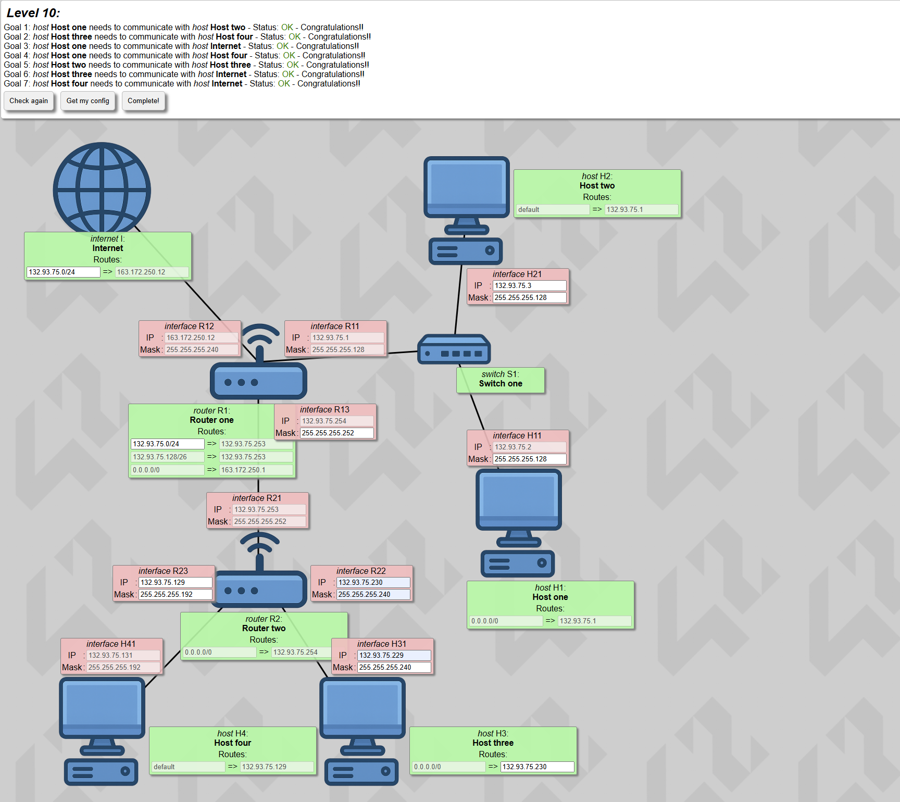

*This project has been created as part of the 42 curriculum by oimzilen.*

# NetPractice

## Description

NetPractice is a practical networking project designed to introduce the fundamentals\
of computer networks.

The goal of this project is to understand and correctly configure IPv4 addressing,\
subnet masks, default gateways, routers, and basic network communication so that\
small network topologies function correctly.

The project consists of solving 10 networking exercises using a web-based training\
interface.  

Each level presents a non-functional network diagram that must be fixed by\
configuring the correct network parameters in the unshaded fields.

---
## Instructions

### Running the training interface
1. Download the NetPractice project files from the official 42 subject page.
2. Extract the files into any directory on your computer.
3. Open the `index.html` file using **Google Chrome or a Chromium-based browser**.  (Firefox may not work correctly due to security restrictions.)
4. Enter your 42 login when prompted.
5. Solve each level by modifying only the unshaded configuration fields.
6. Once a level is solved, click **“Get my config”**.
7. Save the downloaded configuration file when prompted by your browser.
### Submission requirements

- You must complete **10 levels**.
- You must export **one configuration file per level**.
- The exported files correspond to **levels 1 through 10**.
- All **10 exported configuration files** must be placed at the **root of this Git repository**.
- Only the files present in the repository root will be evaluated.

---
## Resources

### Networking concepts studied

The following networking concepts were studied and applied throughout this\
project:

- **TCP/IP addressing (IPv4)**
- [what is TCP/IP and OSI? // FREE CCNA // EP 3](https://www.youtube.com/watch?v=CRdL1PcherM)
- [TCP/IP Model Explained | Cisco CCNA 200-301](https://www.youtube.com/watch?v=OTwp3xtd4dg)
- [IP addresses. Explained.](https://www.youtube.com/watch?v=7_-qWlvQQtY)
- **Subnet masks and CIDR notation**
- [Subnet Mask - Explained](https://www.youtube.com/watch?v=s_Ntt6eTn94)
- [Subnetting Made Simple](https://www.youtube.com/watch?v=nFYilGQ-p-8)
- [What is CIDR?](https://aws.amazon.com/what-is/cidr/)
- **Network and broadcast addresses**
- [CCNA - Network, Host and Broadcast Addresses](https://www.youtube.com/watch?v=eDNiXuFyMyA)
- **Default gateways**
- [Default Gateway Explained](https://www.youtube.com/watch?v=pCcJFdYNamc)
- **Routers and switches**
- [Hub, Switch, & Router Explained - What's the difference?](https://www.youtube.com/watch?v=1z0ULvg_pW8)
- **OSI model**
- [OSI and TCP IP Models - Best Explanation](https://www.youtube.com/watch?v=3b_TAYtzuho)
- [7 Layers Explained](https://www.imperva.com/learn/application-security/osi-model/)
### Use of AI

AI tools were used during this project for:

- Summarizing networking concepts.
- Clarifying subnetting logic and default gateway behavior.
- Assisting with research and understanding theoretical concepts.

All network configurations and final answers were produced manually, fully
understood, and verified by the author.

---
## Repository Content

This repository contains:
- 10 exported configuration files (one per level)
- This `README.md` file
---

## NetPractice Project Detailed Documentation

First of here are my level configs 1 to 10.

### Levels 1-10

#### Level 1

#### Level 2

#### Level 3

#### Level 4

#### Level 5

#### Level 6

#### Level 7

#### Level 8

#### Level 9

#### Level 10

### OSI Model

The **OSI model** is a **conceptual map** that explains **how data moves from one computer to another over a network**.

It is a Protocol, a set of rules, or better layers of protocols together achieving one goal, sending data from a device to another over the network.

#### Layer 7 (Application)

This layer is responsible for for setting the data to send over the the network, using a protocol like HTTP for example when requesting a website page, or sending a message through SSH, and so on, this data  is handed down to layer 6

it simply prepares the data to send, not yet encoded into binary or anything.

#### Layer 6 (Presentation)

Layer 6 prepares the data for transition, depending on the protocol, for example `https` it encrypts it, it also encrypts the data to save bandwidth, which is the max amount of data that can be transferred over  a network at a given time.

#### Layer 5 (Session)

This Layer is responsible for creating a session to talk to the other device, for example like saying i want to talk to `this ip` on port  `433`

this session has an id and info to keep track of it and so on, this is all managed here.

then the data or PDU is transferred to the Transport Layer.

#### Layer 4 (Transport)

now the transport layer, given the data from layer 5, and the session, it starts to employ protocols to split the data into chunks, and makes sure it is sent and will arrive in the right order

The data here is called a segment, because of that.

here it decides on which use TCP or UDP for the transmission protocol

and also the port identifying which application on the device we want to send to.

##### TCP

simply a set of rules on how the will the segments arrive over a network, it makes sure they arrive in order and no duplicates, using a handshake and acknowledgement protocol like SSH.

it trades time and speed for reliability.

##### UDP

UDP just sends the segments over the network, without making sure there is a connection, and the segments arrive without any loss, used for speed and stuff like video streaming,

#### Layer 3 (Network)

It is responsible for logical IP addressing to source and destination devices, this is where the router operates, when connecting with a device over the network.

The data here becomes a packet

#### Layer 2 (Data Link)

here the packed is wrapped into a frame, which now include a physical device mac address.

it is used by the switch or router to identify devices on the same network.

the MAC address is imbedded by the manufacturer 

after that the frame is sent as bits 1s and 0s, over the network

#### Layer 1 (Physical)

The data is then sent as electrical signals over
ethernet wires or wirelessly in the form of radio waves.